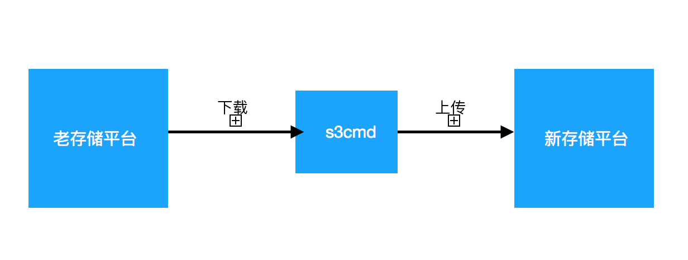
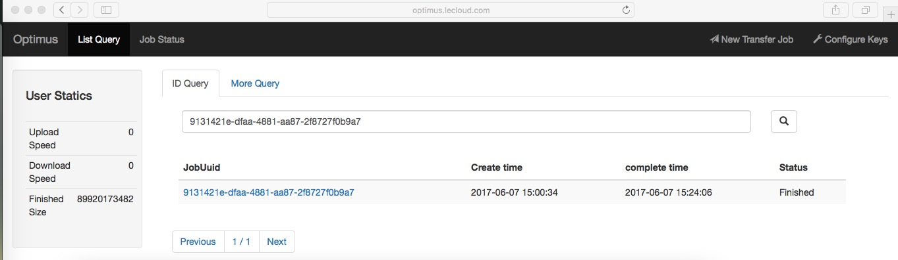
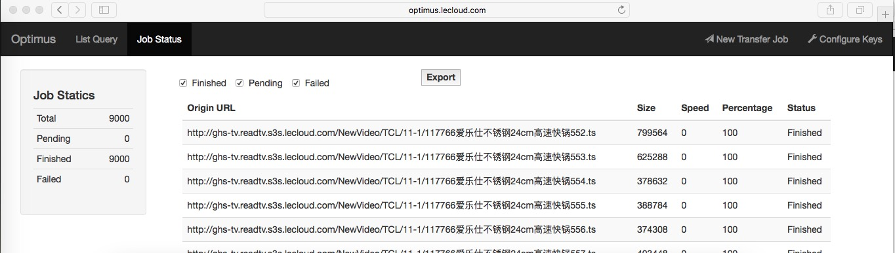
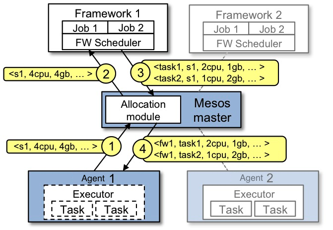
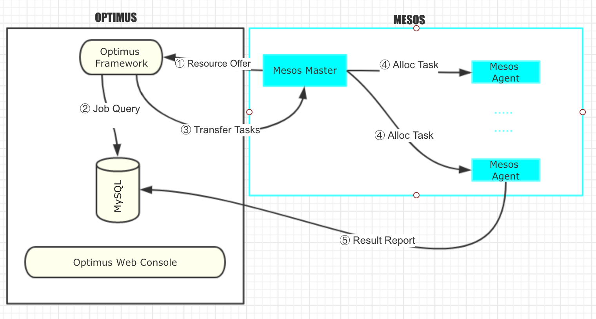
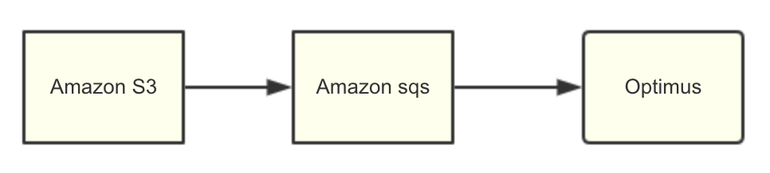
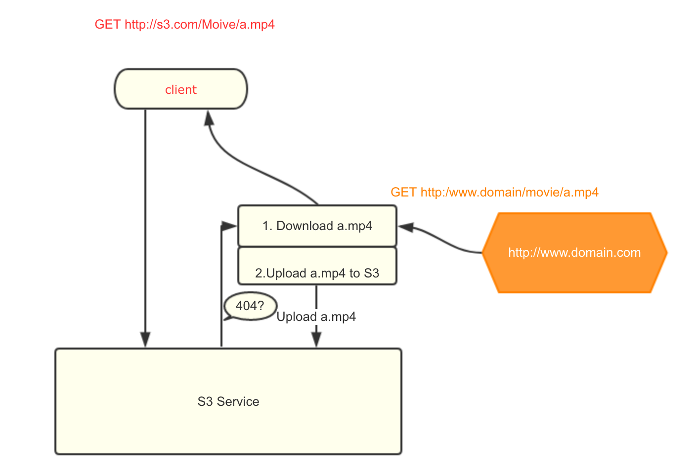
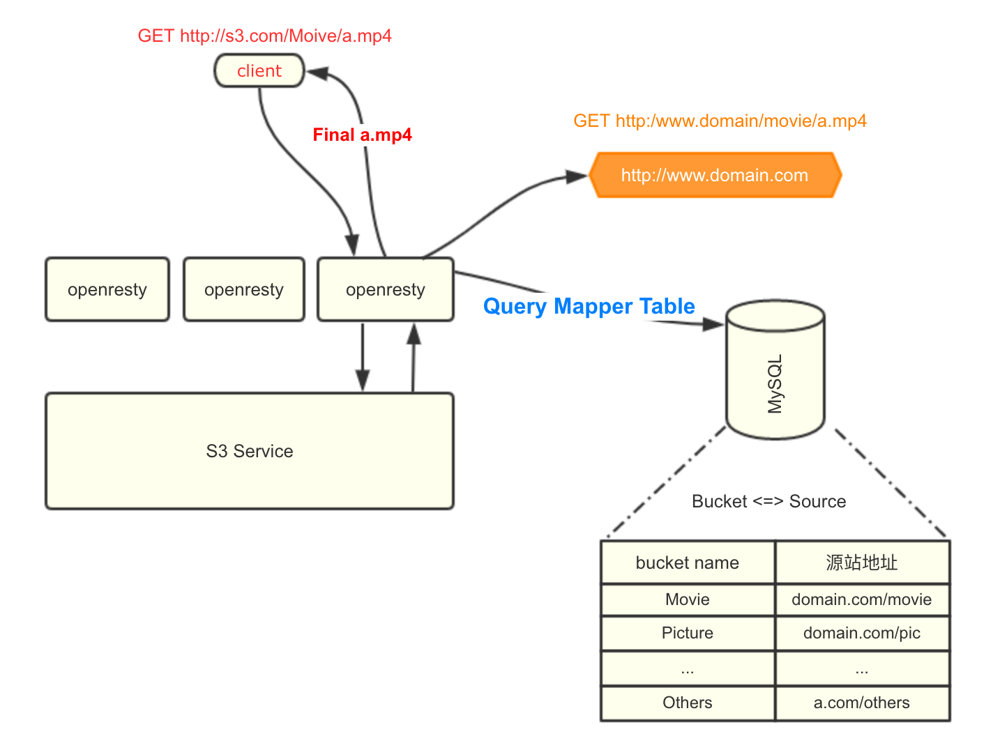
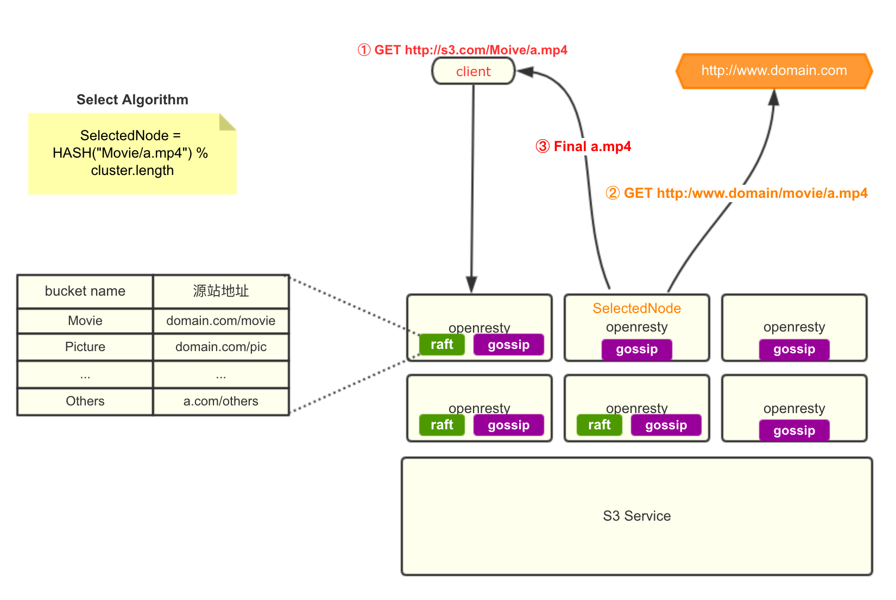

#  PB级对象存储迁移系统


在购买了对象存储或者自己搭建了对象存储系统之后（开源的实现如ceph,  minio, openstack swift), 会面临一个巨大的挑战。

*如何把已经存在的数TB数据快速稳定的迁移到新的分布式平台?*


在实践中，如果用单机的数据管理工具如(s3cmd, cyberduck)遇到的最大问题就是单机的带宽瓶颈，
尤其在一遍下载和一遍上传的情况下，需求的带宽更多。


除了带宽的问题外，在单机迁移大量数据，还存在：


+  无法做到高可用，文件上传不能自动重试
+  不能保证数据完整性
+  如果老的存储平台数据持续增加，不能做到增量迁移，还需要人工干预这些缺点


所以需要一个分布式的，可以弹性收缩的，高可用的，数据迁移平台满足如今大数据存储的迁移需求。

+ 分布式

   提供多服务器，大大提高数据迁移带宽
   
+ 弹性收缩

   在实践中，我们发现数据迁移服务在平时绝大部分时间没有访问，但是一旦有了大型任务，就变成
   io较重（上传和下载）和 cpu较重（计算md5校验数据完整性）。
   
+ 高可用

   为了数据迁移的完整性，需要除了需要验证单个文件的完整性之外，还需要验证是不是所有文件都成功迁移，
   么有遗漏，需要在系统层面提供重试机制

# 对象存储主动迁移系统

##  功能

注册用户在auth成功的情况下，向服务发起一个PUT请求， 请求体:
 
```
{
"origin-files":[
"http://domain.com/abc.txt",
"http://domain.com/def.jpg",
"http://domain.com/bad.mp4",
],
"target-type":"s3",
"target-bucket":"bucketone",
"target-acl":"public-read",
}
```


这个内容非常好理解，就是把网站http://domain.com下面三个文件，分别是abc.txt,  def.jpg,  bad.mp4 这三个文件迁移到一个
[S3](https://aws.amazon.com/s3/)的service上面， 对应的bucket名字是bucketone

服务器返回200，说明迁移平台已经接受的任务，会在未来开始运行。

用户可以通过callback url或者status的API查看任务进度，或者从web console上也可以看到：



这个jobID展开，就可以看到具体迁移了哪些文件




## 实现

这个系统从直觉上非常简单，不就是把迁移任务分配到若干台服务器上么？ 只要有一个master的服务器接受任务，切分任务，把任务分配到某个agent服务器上就行了。

这其中难点:

1. 如何收集agent上的数据，检查是否还有资源运行迁移任务*
2. 离迁移任务，不要互相影响*

这不就是典型的资源调度问题么？ 干嘛重新造轮子？可选的框架很多

+ [kubernetes](https://kubernetes.io/)
+ [Mesos](http://Mesos.apache.org/)
+ [google borg](https://research.google.com/pubs/pub43438.html)

都可以管理这些资源，为了快速开发，就选用了最好上手的Mesos.

### Mesos原理和架构



1. Mesos Agent1，实际上就是具体的worker上报给Mesos master自己有多少资源，这里报告有4cpu和4GB内存

2. Mesos master轮询每个Framework， 这里提高出有4cpu和4GB内存的资源

3. Framework1被Mesos master问到，现在集群有4cpu,4GB内存，你有没有任务需要用这些资源。
所谓的Framework其实就是一个注册到Mesos master的一个daemon, 它最重要的函数就是实现一个resourceOffer的函数

```
ResourceOffers(driver sched.SchedulerDriver, offers []*Mesos.Offer)
```

里面Mesos.Offer包含了“我有4cpu, 4GB"的信息， 这时候Framework1的ResourceOffer检查自己要跑的job，看有没有可以在资源4cpu,4GB的情况下跑的任务，
这时Framework1根据自己Task, 生成了2个Task， 如Task1, 主要信息包括：

+ 占用2cpu，1GB内存，
+ taskID号
+ 运行任务的程序的http下载地址

4. Mesos master从Framework1得到Task信息，在Mesos Agent1上面分配资源，并且下载可执行代码，运行Task


### Optimus迁移平台架构

Optimus是一个Mesos Framework的实现，它与[marathon](https://Mesosphere.github.io/marathon/), [aurora](http://aurora.apache.org/)这些著名的Framework一样
都是一个Mesos scheduler, 工作在Mesos平台之上。




根据上面的Mesos原理，很容易构造一个任务平台，流程如下:

1. Mesos master对Optimus Framework做resource offer的请求, 查询是否有任务要分配
2. Optimus Framework接到offer请求后，查询数据库，匹配迁移Job和Mesos提供的资源，如果有合适的资源，
就把一个Job（比如这个Job可能很大，比如要迁移1W个文件），拆分成若干小的Task, 返回Mesos master
3. Optimus Framework返回切分好的Task
4. Mesos master按照自身逻辑，分配Task到agent
5. agent上运行任务，并把迁移结果和中间状态记录在数据控，方便查询


## Optimus是否达到预期效果？

+ 分布式？

    这个取决于Mesos可以接入多少agent，总已经公开的论文上看，在Mesos在生产环境上接入了上千个node. 可以很容易的线性扩展。
    虽然Optimus Framework是一个单点，所有的计算都集中在一台服务器，但是考虑到拆分任务的cpu压力很小，可以忽略。
    
+ 弹性收缩？

    如果发现Mesos集群的资源不足，给Mesos集群加一台服务器非常简单，只要部署上Mesos agent就行，它的所有程序都跑sandbox下，运行完成后会自动清理。 在没有
    Optimus Framework的情况下或者没有迁移任务的情况下， Mesos集群完全可以连接其他Framework做计算，比如[marathon](https://Mesosphere.github.io/marathon/)等等
    这样这个迁移平台完全是可以弹性伸缩的。
    
+ 高可用

   这个问题分2部分看：
   1. Mesos平台的高可用，其中最重要的就是Mesos master的高可用，可以参考此文[Mesos High Availability](http://Mesos.apache.org/documentation/latest/high-availability/)
   2. 另外就是Optimus平台本身的高可用，这里的Mysql我们使用了主备的架构，保证数据完整性。Optimus Framework的确是单机的。但是它完全是一个无状态的程序，因为注册的状态
   存储在Mesos里面，Job的状态存储在数据库中。可以很容易的把Optimus Framework放到[marathon](https://Mesosphere.github.io/marathon/)或者[kubernetes](https://kubernetes.io)
   或者更加传统的[pacemaker](http://clusterlabs.org/)
  

## Optimus在实践中的经验

### 不是所有的Mesos消息都是可靠的

参考[Mesos Guide Book](http://Mesos.apache.org/documentation/latest/high-availability-framework-guide/)

```
Mesos provides unreliable messaging between components by default
```

其中除了status update 消息，Mesos系统会帮助你重发外，所有其他消息都不是可靠的。
这就需要Framework的开发者自己存储Task的状态，比如我们就存储数据在mysql。
自己做timeout, 判断是否需要重新调度任务。

此外在Guide book也提到了也可以采用选举方式让Framework本身变得高可用，但这样编码会复杂很多（因为要同步内存数据和检查leader是否真的死机），我们采取最简单的方式：
把核心数据全部存储在MySQL， 然后把Optimus Framework放到[marathon](https://Mesosphere.github.io/marathon/)


### 为什么使用golang开发Optimus Framework 和 Mesos Executor

首先是介绍一下Mesos Executor, Executor是Mesos agent在sandbox里面运行的程序，比如在Optimus里面这个Executor的执行逻辑就是

```

url = GetUrl()
temp_file = http.get(url)
s3.upload(temp_file);

```

就这么简单。c++,  java, python,  golang, scala这些语言都支持。 采用golang除了编码简单外，还有非常大的好处，就是特别容易部署和升级，
所有的依赖都是静态编译，只要编译出了一个binary，就可以运行。 不像之前用python写的executor, 我们还有依赖[boto](http://boto.cloudhackers.com/en/latest/ref/s3.html)
还需要先执行一个preinstall.sh的脚本下载依赖。非常麻烦。

此外在线上的agent有centos6 和 cenos7，甚至还有一台ubuntu, 静态编译的golang binary都稳定的运行在上面。

当然，也可能会有人问Mesos也支持container, 为什么不用docker呢？ 
答： 毕竟编译golang binary还是比docker镜像小太多的

所以既然Executor已经用golang写了，为了项目的一致性，Optimus Framework也是用golang实现的，之前我们还有些疑问， 毕竟 大部分的Mesos官方例子都是
Java和Python, 就行golang的库是否稳定，结果证明虽然当时Mesos社区还把golang版本作为实验版本，但是我们线上跑的结果显示非常稳定。

## Optimus在实践中的典型应用

1. 全量异地备份

用户提交全量数据的url列表到Optimus集群，每个Job完成后会自动提示Job完成，
如果Job中有失败的情况，会自动重试。

2. 增量异地备份

我们也接受过这样的情况, 美国用户把Amazon S3当作一个存储片源的服务，如果有新的影片，需要异步备份到别处。就采用了这样的架构




[Amazon S3](https://amazonaws-china.com/cn/s3/)存储数据，一旦有新的文件加入，会在[Amazon sqs](https://amazonaws-china.com/cn/sqs/)中出现一条新的消息，把这个小型用http的形式发到Optimus,
就会只传输这条增量视频

 
 
# 对象存储自动回源系统

## 功能

在上面的系统里面，仍然需要整理url列表，和写程序提交url。有些用户觉得很麻烦，探索有没有lazy的方式，在S3的存储miss的情况下，
访问源站拉数据，并返回给用户。

这个功能如图示，橙色标志了源站，有一个中间层，检查http code时返回值，如果是404，这个中间层需做2件事情：

1. 配置好的源站拉数据并且返回给用户，保证这次请求顺利完成
2. 拉下的临时文件再重新上传回存储，自动做镜像，保证以后请求相同文件都不会回源站




这个系统的优势非常明显：

1. ondemand的下载请求，大大减少了一次大规模迁移的压力
2. 源站只要配置bucket对应的回源地址就行。不需要任何写代码
3. 一旦配置完成，新存储可以自动无缝的镜像源站内容。


## 实现

### 实现1 架构

1. 为了保证S3 API的完整性，不需要修改S3标准API，只需要在proxy这层做。 这里的7层proxy选择[openresty](https://openresty.org/cn/). openresty可以方便的使用lua调用nginx的模块。
2. 在openresty层，用lua代码检查返回值，如果是[404](https://zh.wikipedia.org/wiki/HTTP_404)，则查询数据库用户请求的文件 *Movie/a.mp4* 是否配置了自动回源地址。
通过查询数据库发现Movie这个bucket对应的回源地址是http://domain.com/movie. 按照和用户约定好的规则重新rewrite url,从http://s3.com/Moive/a.mp4变成http://www.domain.com/movie/a.mp4
3. lua脚本启动一个新的[coroutines](https://openresty.org/cn/lua-nginx-module.html), 发起http GET下载到临时地址，并且下载完成后，上传到S3存储中。
4 另一方面，openresty把正在下载的临时文件发给用户，这样对用户透明，用户并不需要在下载前知道S3存储中一定存在这个文件
5. 在实践中还有一个选择，如果下载的时候发现是404，可以给用户一个[302](https://zh.wikipedia.org/zh-hans/HTTP_302), 让用户跳转回源站，然后openresty再异步的下载源文件。但是这样做有一个缺点。如果用户的文件数量很大，或者多用户下载同一个文件，都跳转的话回给用户源站短时较大压力，这样就失去了做云存储镜像的意义。所以选择还是把压力放到S3服务端，并且加入策略，用户可以对自己的源站配置最大下载带宽。





### 实现2架构

在实现1中，有2个缺点需要克服：

1. 这个系统还是有些重，需要增加一个数据库去存储bucket和源站的映射是在是太浪费了，可以预见这个数据表不会超过几千万行。
2. 多用户同时下载同一个在存储中不存在的文件时,  我们希望这些请求都落在同一台openresty上面。

所以，综上所属。我们需要的新功能分别是：

1. 一个足够轻量级的分布式KV数据库，复用已经有的openresty服务器，存储bucket和源站地址之间的映射。
2. 一个router算法保证回源的请求都落在同一台openresty上面， 这里选择一个最简单的算法, 
就是对URL做md5sum后取mod。
```
SelectedNode = md5sum("Movie/a.mp4") % cluster.length
```
为了达到高可用，需要这个系统能自动检查openresty节点是否可用，需要memberlist的管理。

根据以上的2点需求，做一个简单的选型, 我们在这里并没有选择知名的，又有些偏重的开源应用。
而是选择了库文件，在上面做二次开发，达到系统最轻最小的目的
1.  分布式kv: [Raft](https://github.com/hashicorp/raft) , 知名的[Etcd](https://github.com/coreos/etcd)也是用的类似算法，
我们使用[boltdb](https://github.com/boltdb/bolt)作为底层存储。

2. 主流的heartbeat算法就2种，一个是像master节点汇报的如[hdfs](https://hadoop.apache.org/docs/r1.2.1/hdfs_design.html),
也有采用gossip算法的，如[cassandra](http://docs.datastax.com/en/cassandra/2.1/cassandra/architecture/architectureGossipAbout_c.html)
我们这里选择了一个开源gossip库[memberlist](https://github.com/hashicorp/memberlist). 非常类似与[consul](https://www.hashicorp.com/products/consul/)

选择开源库而不是开源应用，是因为我们希望build出非常轻量和便于运维部署的binary, 而不是要给运维写出一大堆部署文档的应用。

架构图如下：

1. 之前实现1中的Mysql已经被raft协议下工作的boltdb代替
2. openresty之间再也不是松散的关系，他们可以依靠gossip协议维护memberlist, 这样不管openresty的服务器宕机还是
重现上线，都可以自动发现和自动去除




## 自动回源在实践中的典型应用

1. 全量异地备份

用户只要拿到自己需要备份的数据的url list, 对每个url发起HEAD请求，注意不是GET请求，
如果是GET请求就真的下载下来了。

2. 增量异地备份

自动回源系统相当于完全的源站的镜像，对用户完全透明，只要配置好bucket和源站的映射关系，
用户完全可以像用自己的源站（拥有全部数据）一样使用S3存储（自动同步需要的数据）


