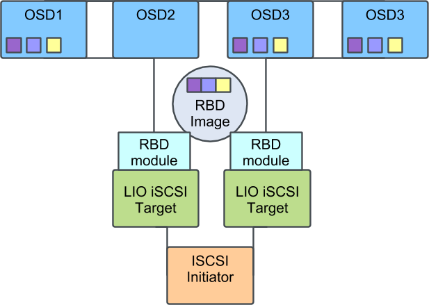
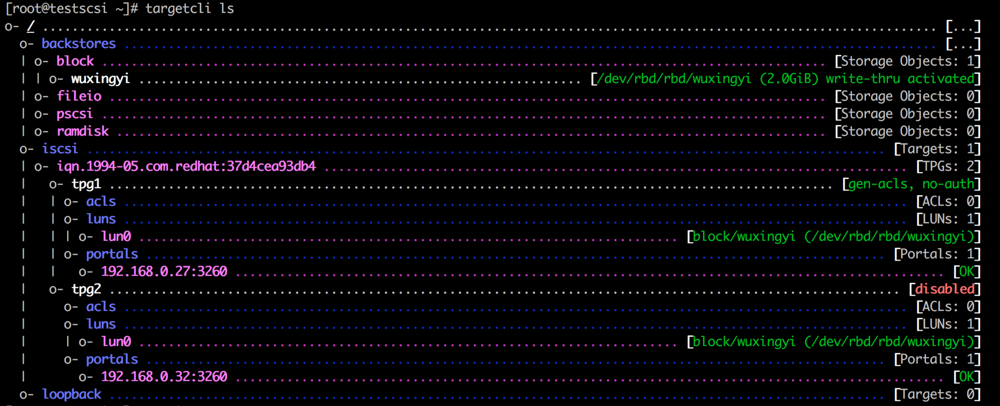
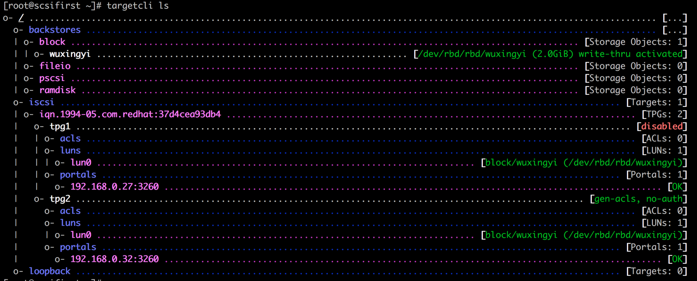
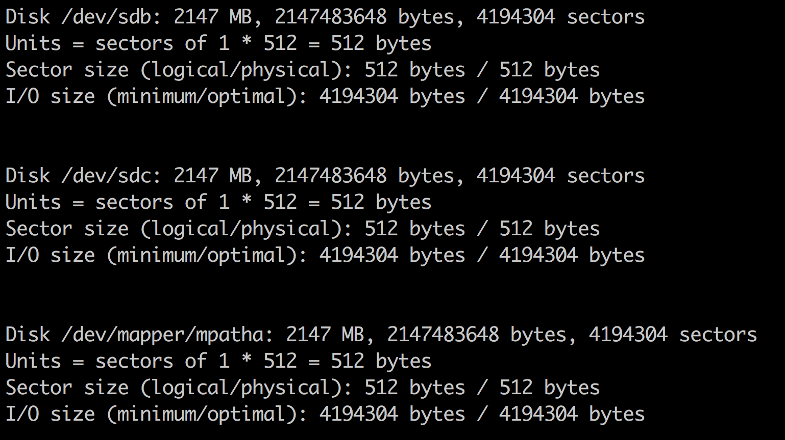
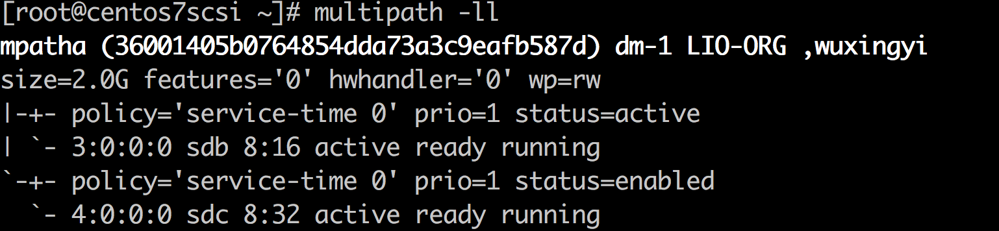
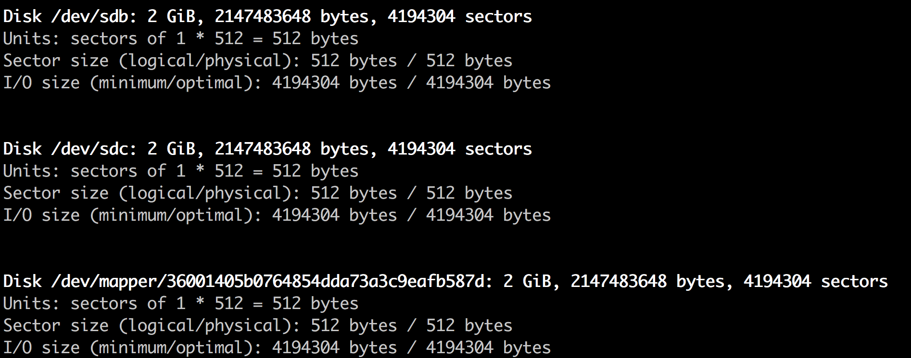

# rbd+iscsi gateway+multipath技术方案

## 0.技术方案：

方案的拓扑结构如下图所示，两个运行iscsi target的节点上都运行着rbd kernel module，  
通过他们可以跟后端的ceph集群通信，iscsi initiator则完全不依赖于任何的ceph相关的lib，  
另外，通过两个target导出同一个rbd image，可以实现target的HA，这就需要运行两个target，同时在initiator上运行multipath。  



## 1.系统准备：

要顺利部署出支持multipath的iscsi gateway，第一步是把部署需要部署iscsi gateway的节点的kernel升级到至少3.10.0-514.6.2.el7(发布于2017年2月)，  
在这个release中下面这个patch起了决定性作用，如果不合入这个patch，initiator将会把两个不同portal导出的同一个的lun看成两个不同的lun，  
从而multipath也就不可能成功了，本人研究这个方案时，在这个地方卡了很久，直到在lrbd代码中看到```tpg_enabled_sendtargets```是问题的关键，才去查找相关kerneld的path。  


## 2.安装工具包：

```
yum install iscsi-initiator\* device-mapper-multipath -y
```

## 3.本方案使用了suse的lrbd包，但这个只有source rpm，可以根据srpm自己build出来使用, 此处不赘述。  

## 4.配置一个配置文件： 

选择两台服务器(本文以192.168.0.27和192.168.0.32为例)，编写一个config.json配置文件，配置两个iscsi gateway，配置文件如下：

```
{
  "auth": [
    {
      "authentication": "none",
      "target": "iqn.1994-05.com.redhat:37d4cea93db4"
    }
  ],
  "targets": [
    {
      "hosts": [
          { "host": "testscsi.novalocal", "portal": "portal1" },
          { "host": "scsifirst", "portal": "portal2" }
      ],
      "target": "iqn.1994-05.com.redhat:37d4cea93db4"
    }
  ],
  "portals": [
      {
          "name": "portal1",
          "addresses": [ "192.168.0.27"]
      },
      {
          "name": "portal2",
          "addresses": [ "192.168.0.32"]
      }
  ],
  "pools": [
    {
      "pool": "rbd",
      "gateways": [
        {
          "target": "iqn.1994-05.com.redhat:37d4cea93db4",
          "tpg": [
            {
              "image": "wuxingyi"
            }
          ]
        }
      ]
    }
  ]
}
```

配置文件的意思是，将rbd这个pool的wuxingyi这个image导出为iscsi lun，target的名字是iqn.1994-05.com.redhat:37d4cea93db4，initiator可以通过192.168.0.27和192.168.0.32两个path去连它。  

## 5.创建rbd镜像

在rbd这个pool中创建一个名为wuxingyi的image，并disable掉相关feature，以便能够顺利的被rbd map上：  

```
imagename=wuxingyi
rbd create $imagename --size 2048
rbd feature disable $imagename deep-flatten
rbd feature disable $imagename fast-diff
rbd feature disable $imagename object-map
rbd feature disable $imagename exclusive-lock
```

## 6.使用lrbd工具

在192.168.0.27和192.168.0.32上先后运行一下命令行：  

```
lrbd -C
lrbd -f config.json
lrbd
```

在192.168.0.27结果如下：

```
rbd -p rbd map wuxingyi
/dev/rbd0
modprobe target_core_iblock
targetcli /backstores/block create name=wuxingyi dev=/dev/rbd/rbd/wuxingyi
Created block storage object wuxingyi using /dev/rbd/rbd/wuxingyi.
targetcli /iscsi create iqn.1994-05.com.redhat:37d4cea93db4
Created target iqn.1994-05.com.redhat:37d4cea93db4.
Created TPG 1.
targetcli /iscsi/iqn.1994-05.com.redhat:37d4cea93db4 create 2
Created TPG 2.
targetcli /iscsi/iqn.1994-05.com.redhat:37d4cea93db4/tpg2 disable
The TPGT has been disabled.
targetcli /iscsi/iqn.1994-05.com.redhat:37d4cea93db4/tpg1/luns create /backstores/block/wuxingyi
Created LUN 0.
targetcli /iscsi/iqn.1994-05.com.redhat:37d4cea93db4/tpg2/luns create /backstores/block/wuxingyi
Created LUN 0.
targetcli /iscsi/iqn.1994-05.com.redhat:37d4cea93db4/tpg1/portals create 192.168.0.27
Using default IP port 3260
Created network portal 192.168.0.27:3260.
targetcli /iscsi/iqn.1994-05.com.redhat:37d4cea93db4/tpg2/portals create 192.168.0.32
Using default IP port 3260
Created network portal 192.168.0.32:3260.
targetcli /iscsi/iqn.1994-05.com.redhat:37d4cea93db4/tpg1 set attribute authentication=0 demo_mode_write_protect=0 generate_node_acls=1
Parameter authentication is now '0'.
Parameter demo_mode_write_protect is now '0'.
Parameter generate_node_acls is now '1'.
targetcli /iscsi/iqn.1994-05.com.redhat:37d4cea93db4/tpg2 set attribute authentication=0 demo_mode_write_protect=0 generate_node_acls=1
Parameter authentication is now '0'.
Parameter demo_mode_write_protect is now '0'.
Parameter generate_node_acls is now '1'.
```

通过targetcli验证一下结果：  



而在192.168.0.32上，disable掉的则是tgp1：  



## 7.启动initiator上的multipathd进程：

```
mpathconf --enable --with_multipathd y
systemctl start multipathd
```

## 8.配置initiator(ip为192.168.0.33)：

向192.168.0.27发送discovery包，可以看到两个target：  

```
[root@centos7scsi ~]# iscsiadm -m discovery -t sendtargets --portal 192.168.0.27:3260
192.168.0.27:3260,1 iqn.1994-05.com.redhat:37d4cea93db4
192.168.0.32:3260,2 iqn.1994-05.com.redhat:37d4cea93db4
```

向192.168.0.32发送discovery包，也可以看到两个target:  
```
[root@centos7scsi ~]# iscsiadm -m discovery -t sendtargets --portal
192.168.0.32:3260
192.168.0.27:3260,1 iqn.1994-05.com.redhat:37d4cea93db4
192.168.0.32:3260,2 iqn.1994-05.com.redhat:37d4cea93db4
```

登录target：  

```
iscsiadm -m node -l
```

此时可以看到：

```
Logging in to [iface: default, target: iqn.1994-05.com.redhat:37d4cea93db4, portal: 192.168.0.32,3260] (multiple)
Logging in to [iface: default, target: iqn.1994-05.com.redhat:37d4cea93db4, portal: 192.168.0.27,3260] (multiple)
Login to [iface: default, target: iqn.1994-05.com.redhat:37d4cea93db4, portal: 192.168.0.32,3260] successful.
Login to [iface: default, target: iqn.1994-05.com.redhat:37d4cea93db4, portal: 192.168.0.27,3260] successful.
```


通过fdisk可以看到：  



可以看到两个块设备sdb和sdc，但是呢，sdb和sdc都不能被直接操作(不能被mkfs等操作)，因为multipath已经把它俩合成了一个新的设备，即/dev/mapper/mpatha.   
此时运行```multipath -ll```，可以看到：  



现在就可以正常的操作/dev/mapper/mpatha这个块设备了。  
initiator对用户的操作系统没有要求，也不需要运行ceph及ceph的client，本人在centos 7和ubuntu 16.04上验证均通过，只需要initiator上运行了multipathd即可.  
ubuntu 16.04如下：



## 8.windows上的initiator配置

类似的，windows上也可以选择类似的方式来打开MPIO，具体方式可以参考[suse提供的文档](https://www.suse.com/documentation/ses-2/book_storage_admin/data/ceph_iscsi_connect.html)
