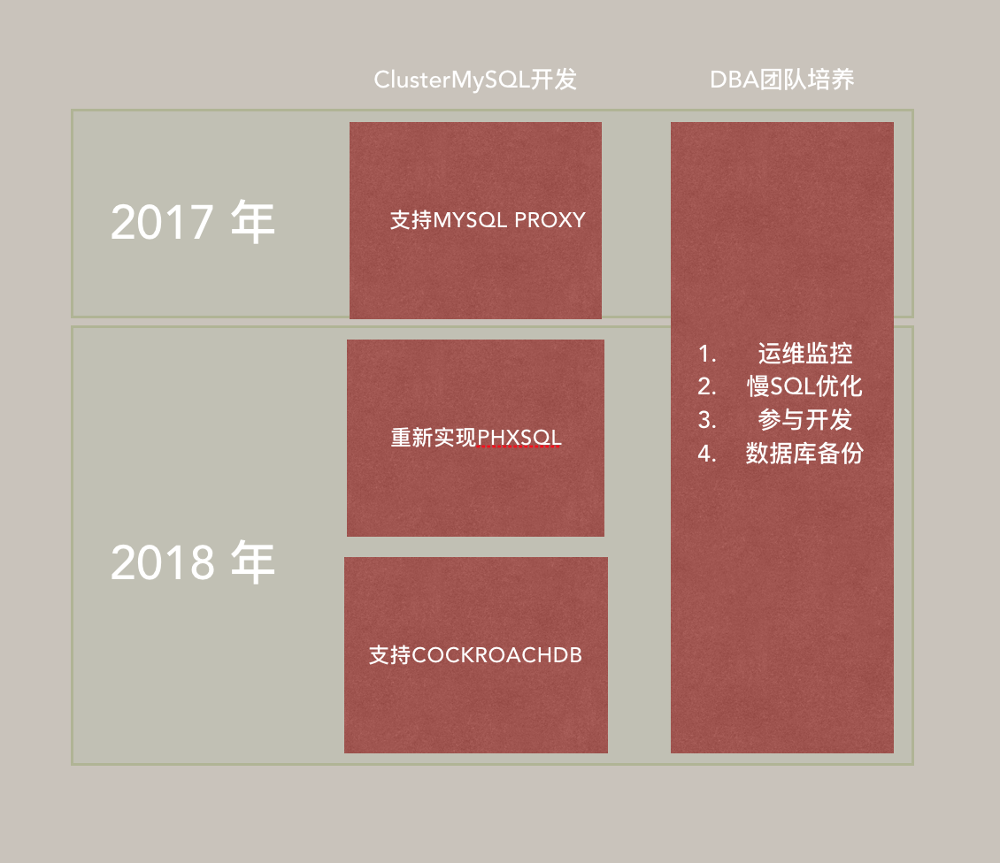
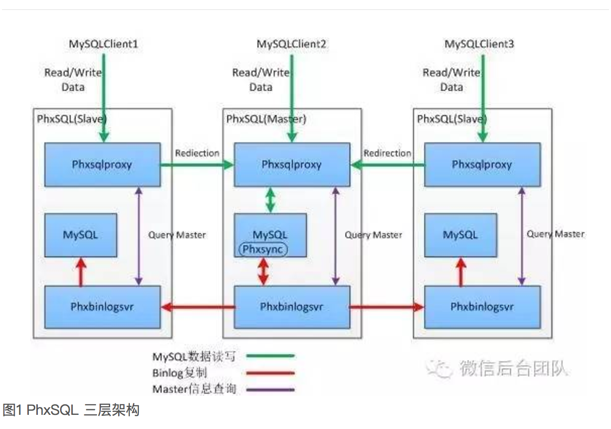

# 目的:

提供两地三中心的SQL服务

这里面的两地三中心要求数据延迟小于30ms,距离如北京到上海之间。
如果2地延迟超过100ms, 就不再属于两地三中心SQL服务的范畴。

# 不支持什么？

团队资源有限，数据库是一个极大的概念，内容很多，必须有所取舍

1. 不支持OLAP, 不帮助提供tunning服务
2. 不支持NoSQL,如[Hbase](https://hbase.apache.org/), [MongoDB](https://www.mongodb.com/)
等等, 如果NoSQL可以满足需求，推荐用户用NoSQL
3. 分层设计，只考虑在SQL层，有资源的情况下，如果提供SQL服务，不涉及底层的资源调度.
(如开发云数据库等等)

# 路线图

见图:

## 说明

分2条线，一个是运维线路，另一个是开发线路. 运维始终与开发共同进步,

开发线路分3步走， 2017年支持proxy, 2018年支持phxsql, 未来支持newsql

### Proxy方案

#### 支持

2017年：

MySQL-proxy社区mysql-proxy已经出现多年，提供了在proxy层面读写分离，写到主库，
读到从库,可提供的选择有:

+ https://github.com/mysql/mysql-proxy 原生mysql-proxy
+ https://github.com/Qihoo360/Atlas 奇虎公司开源的修改过的mysql-proxy
+ https://tech.meituan.com/dbproxy-pr.html 美团修改的Atlas
+ https://github.com/flike/kingshard go实现的proxy,也在生产环境有使用 

最终选择支持kingshard，原因：
1. Production-Ready
2. 符合团队的技术栈
3. 在浏览过altas和dbproxy的feature list和bug list之后，发现他们的主要feature都是运维相关，bug也是minor bug. 并没有那么神奇

所以kingshard的上线流程是:
1. 场景测试,压力测试, 配合Mysql 5.7之后的lossless复制方案
2. 补全监控
3. 浏览代码

#### 不支持什么？

1. sharding, 在proxy层面支持sharding, 意味这DBA要和业务详细的讨论sharding的方案，并且配置到proxy上面，不符合去耦合的原则. 并且如果业务真需要sharding的情况，也是业务预计数据量非常大，这种情况建议使用Nosql,如[Hbase](https://hbase.apache.org/), [cassandra](http://cassandra.apache.org), [ScyllaDB](www.scylladb.com/
) ,[MongoDB](https://www.mongodb.com/)

### phxsql

*2018年*:

为什么要继续开发？

上述方案有一个缺点，这个也是Mysql主备的自身缺点，就是不能保证主从节点数据的强一致性,
再正常情况下都没有问题，但是如果发生主库的停机，需要DBA小心操作，确保:

1. 原来的主库确认不再服务
2. 备库变主库
3. 检查同步情况

换句话说，就是之前的方案，运维的压力较大，所以需要更进一步的方案

[phxsql](http://djt.qq.com/article/view/1489), 对比之后提到的各种常见方案
这种方案对MySQL的侵入性最小，方案也最简单清晰。可靠性高.

简单的说就是通过paxos算法保证集群内有且只有一个master节点，这样
1. 保证所有的写请求一定到唯一的服务器，保证主服务器安全切换
2. 主从复制业只会从唯一的选定的主服务复制 
3. paxos算法更容易跑在广域网,对面其他的一致性算法如single totem ring等，更合适两地三中心的配置

#### 小缺点

1. 因为要跑paxo算法，最小节点3台。
2. 统一和proxy方案一样只支持读写分离，不支持sharding
3. 技术栈比较麻烦

里面使用了文档并不是特别全的phxrpc和libco,2个c++的协程库(如果有需要可以再做分享)。 一个是考虑到到团队技术栈
另一个是如果利用更新的技术实现弯道超车，我们需要重新用etcd/raft和grpc重新实现一遍
phxsql. 但是复用其中的mysql plugin.

### New SQL 

*2018年*

可以看到传统的Mysql或者Postgres可以做到HA,但是无法做到真正的scale out,
NoSQL服务可以做到海量存储，但是又无法实现transaction, 所以从spanner的论文开始，业界开始探索newsql的方案，目前已经开源的就2个

1. [cockroachdb](https://github.com/cockroachdb/cockroach)
2. [tidb](https://github.com/pingcap/tidb)

这里在roadmap里面选择cockroachdb, 原因:

1. 团队技术栈, 所以我很喜欢tidb做的把存储层tikv和proxy层tidb分开的方式，但是
rust实在是比c++还复杂,并且社区生态还有待发展
2. golang的gc和cgo的性能问题, cgo的性能问题在cockroachdb的社区也遇到过，他们选择的方案是更多得实现c++代码,减少cgo的调用次数. 或者还有一个方案，就是底层的存储也用go实现. 至于gc的时间，根据社区的对比测试,从go1.6开始，gc时间已经小于10ms. 甚至都可以实现实时系统

### 技术讨论

各种MySQL的HA方案

主备方案

+ pacemaker + 共享存储
+ pacemaker + dbbd
+ phxSQL
+ mysql-proxy

其中mysql-proxy的方案还是在广为使用

主主方案：

+ Galera
+ Mysql Group Replication

Galera曾经是乐视在内部推广的方案

# 参考文档

+ https://zhuanlan.zhihu.com/p/25960208
+ http://blog.csdn.net/wentianyao/article/details/51445940
+ https://news.ycombinator.com/item?id=11496155