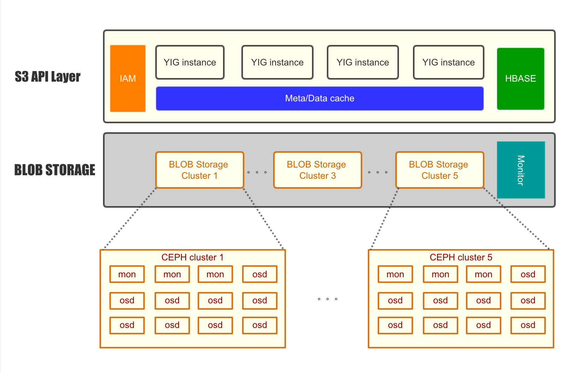
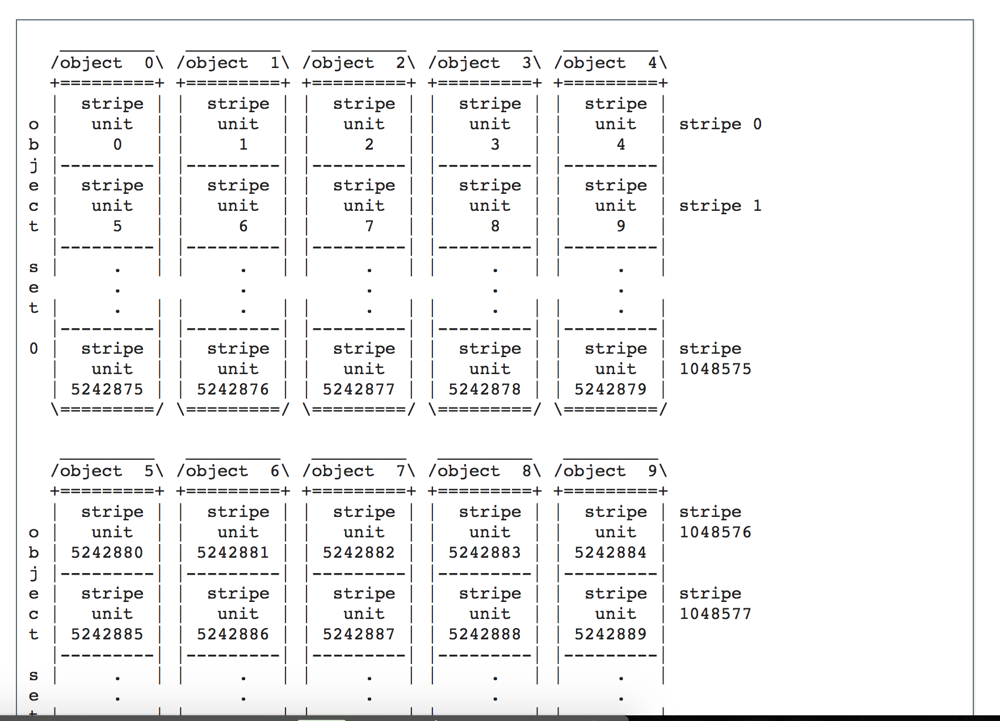
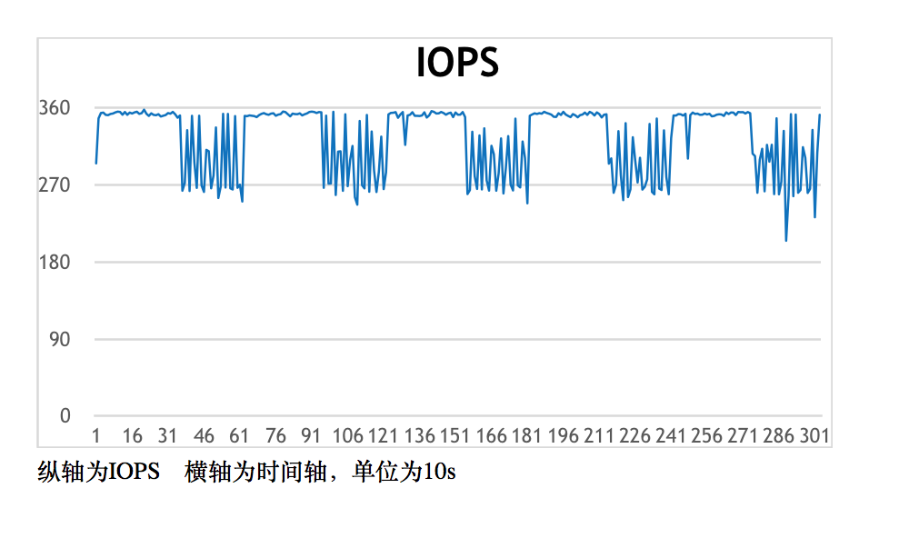
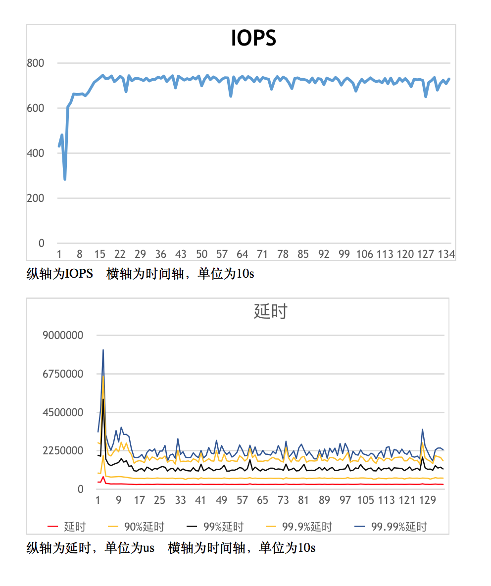

#  Yet another Index Gateway

Yig是S3协议兼容的分布式对象存储系统。它脱胎于开源软件[ceph](http://docs.ceph.com/docs/master/radosgw/)，在多年的商业化运维中，
针对运维中出现的问题和功能上的新需求，重新实现了一遍radosgw用于解决以下问题：

1. 单bucket下面文件数目的限制
2. 大幅度提高小文件的存储能力
3. bucket下面文件过多时，list操作延迟变高
4. 后台ceph集群在做recovery或者backfill时极大影响系统性能
5. 提高大文件上传并发效率

# S3 API

对比其他提供S3 API的开源软件

+ sheepdog 
+ ceph
+ minio
+ yig

# Ceph对象存储遇到的挑战

本文假设读者已经对ceph，ceph/radosgw或者分布式系统，和S3 API有所了解。在这里不会详细介绍
他们的特点和架构。

如果有不清楚的同学建议看[ceph](http://www.ceph.com)的官网了解一下
对S3 API可以参考[Amazon S3](http://docs.aws.amazon.com/AmazonS3/latest/API/Welcome.html)

另外对象存储都是大容量的情况，本文也默认所有的都是普通的机械硬盘。它的特点是：顺序IO快，随机IO特别慢。

## Ceph Radosgw对象存储系统

[radosgw](http://docs.ceph.com/docs/master/radosgw/)的架构如图


 radosgw充分利用了librados底层的4类API完成数据存储的目的，实际上radosgw用的是C++ API，但是这里使用C API便于说明问题
 
 1. rados_read/rados_write
 这组API主要用来存储对象的实际内容，他会根据用户对象的名称生产oid，然后映射到多个osd上，然后写入实际数据，
比较简单，
对应于rados命令行的
```
rados put/get
```
 2. rados_write_op_omap_set/rados_read_op_omap_get_vals
这组API主要用来存储bucket的元数据。
每个ceph osd在初始化的时候会生产一个嵌入式的数据库.
（filestore对应[leveldb](https://github.com/google/leveldb)，bluestore对应[rocksdb](https://github.com/facebook/rocksdb)。用这组API
可以给object设置key-value值。这个API在radosgw里面主要存储重要的bucket下有哪些文件。比如S3里面有一个bucket叫document，里面有3个文件，名字分别是
：
```
A
B
C
```

那么对应的在.rgw.index的pool里面会有一个叫document.XXXX，这里面的XXXX是bucket的instance ID，他的omap对应的就是
```
KEY  VALUE
  A  value
  B  value
  C  value
```

在ceph的J版本之前的，bucket下的文件列表都是由一个object对应的omap记录的。在后续的版本中加入bucket sharding的功能，让文件列表可以由
多个嵌入式KV存储。

 3. rados_getxattrs/rados_setxattrs
 这个API主要存储每个对象的元数据，包括每个分片的信息，ACL，contentType这些信息都用这组API存储和读取。
 它们对应的就是filestore的xfs使用的xattrs，或者bluestore的rocksdb里面的kv对。

 4. rados_exec
 参考文档[cls](https://ceph.com/rados/dynamic-object-interfaces-with-lua/)，传统上增删改查的操作并不以一定满足所有需求。
 比如需要一个计数器，原子的记录一个object访问次数。或者需要在osd上计算一个object的md5，而不需要下载到客户端再进行计算。
 所有的cls操作都是对一个object原子的。用户可以自己编写cls plugins，在osd启动的时候加载。之前只能用c++写，现在从J版本以后开始支持用
 lua写的plugin了。

radosgw使用这个API做原子的操作，或者记录日志。


## 为什么radosgw存储小文件会有性能问题？

从上面的rados存储原理可以看到，要在一个S3兼容的系统里存储数据，它需要存储
1. 数据本身
2. 元数据（ACL，contentype，分片信息）
3. 修改bucket的元数据（bucket下面多了一个Key）
所以可以看出，尽管用户只上传了一个几百字节的文件，甚至还没有一个sector大。但是ceph的多个osd都要发生写操作。如果这是一个大文件，比如
4M，这些overhead就完全可以忽略。文件越小，数量越大，硬盘的随机读写越多。

这种情况在filestore的情况尤其糟糕，filestore所有的写入都先写入自己的jouranl，然后在fflush到文件系统。这种情况在bluestore会好一些，
因为S3的写入都是新文件，没有覆盖或者更新的情况，所有不用写journal，数据直接下盘。


## ceph在rebalance时，对在线环境是否影响很大？

简单的回答；很大

更精确的回答：主要跟迁移的数据量有关，迁移的数据量越大，影响也越大。

我们在线上一个50台服务器的EC集群上，万兆网络，容量超过50%，在掉一台服务器的情况下（需要迁移6T数据），
在默认的迁移线程个数下，新的写入IO速度只有原来的10%;

这时候通常运维工程师的选择是暂停rebalance，保证线上业务，在业务不忙的情况下，比如凌晨继续迁移。但是问题是如果是
3副本，在停止rebalance的情况下，有的pg还是2副本，比预想的副本数要少。通常我们为了保证最优的数据可靠性，希望
rebalance尽快完成，越快越好。但是这点又和数据的可用性矛盾，总不能停服rebalance吧。在线上运维时，掌握这2点的平衡
非常困难。


## radosgw如何提升性能？

  线上在使用ceph时还有其他的优化空间，远远不是调试ceph的参数那么简单，如：

1. 提升.rgw，.rgw.index这些关键元数据pool的性能。

元数据的重要性毋庸置疑。

从容量上看，元数据需要的容量很小。
如果在集群容量不足的情况下，可以采用元数据3副本，.buckets 2副本或者EC的策略。

而从性能看，提升元数据的存取速度可以极大的提升，所以通常都会把元数据的pool放到纯SSD或者SAS盘上面。

2. 辅助功能外移，如日志和统计容量

我们在线上关闭的radosgw的usage功能，也关闭了bucket index log(我们也不需要multi site)功能，本质上的思路都是
在核心的读写流程上面减少环节。用了提升速度。比如日志统计之类的，都可以异步的把radosgw的日志推送到spark集群计算。

3. 更好的cache

有些元数据是需要频繁访问的，比如用户信息，bucket的元数据，这些信息都需要radosgw做cache，但是由于radosgw之间不能直接
通信，无法做invalid cache的操作，导致cache的效率不高。社区的做法是利用共享存储（这里就是ceph的一个object），通过这个object
通信，就可以打开cache. 这种情况在大流量的情况下，性能非常糟糕，我们在线上已经关闭了这个cache。


## Yig设计

设计一个新的存储系统解决以上问题，无非这些思路
1. 隔离后台rebalance影响
2. 根据[haystack](https://www.usenix.org/legacy/event/osdi10/tech/full_papers/Beaver.pdf)的论文，默认的filestore或者bludestore，并不特别适合小文件存储，需要新的存储引擎
3. radosgw对librados提高的omap和cls用得太重，我们如何简化架构，让代码更容易懂，也更不容易出错。
4. 更加统一的cache层，提高读性能

架构如图所见：


从整体看，分为2层

1. S3 API layer，负责S3 API的解析，处理。所有元数据存储在[hbase](https://hbase.apache.org/)中，元数据包括bucket的信息，object的元数据（如ACL，contenttype），multipart的切片信息，权限管理，BLOB Storage的权值和调度。所以的元数据都cache在统一的cache层。可以看到所有元数据都存储在hbase中，并且有统一的cache，相比于radosgw大大提高的对元数据操作的可控性，也提高了元数据查询的速度。
2. BLOB Storage层，可以并行的存在多个Ceph Cluster。只使用 rados_read/rados_write的API。如果其中一个ceph cluster正在做rebalance，可以把它上面所有写请求调度到其他ceph集群，减少写的压力，让rebalance迅速完成。从用户角度看，所有的写入并没有影响，只是到这个正在rebalance的ceph cluster上的读请求会慢一点儿。大规模扩容也非常容易，比如存在这种情况，初期上线了5台服务器做存储，发现容量增加很快，希望加到50台，但是在原ceph集群上一下添加45台新服务器，rebalance的压力太大。在yig的环境中，只要新建一个45台的ceph集群，接入yig的环境就行，可以快速无缝的添加容量。

## 在ceph层提升性能

### 使用libradosstriper API提升大文件读取写入性能

对于大文件，相比与radosgw每次使用512K的buf，用rados_write的API写入ceph集群，yig使用动态的buf，根据用户上传的速度的大小调整buf在(512K~1M)之间。
并且使用[rados striping](http://docs.ceph.com/docs/master/dev/file-striping/)的API提高写入的并发程度。让更多的OSD参与到大文件的写入，提高并发程度。
拆分方法如图：



### 使用kvstore提升小文件存储性能

针对小文件，直接使用kvstore存储，底层使用rocksdb，这个方案相比与bluestore或者filestore更轻。性能更好。但是要注意2点：
1.  默认的kvstore并没有打开布隆过滤器，需要在ceph的配置文件中配置打开，否则读性能会很差
2.  在Ceph的replicatePG层，每次写object之前，都会尝试读取原Object，然后在写入。这个对于rbd这种大文件的应用影响不大，但是对于小文件写入就非常糟糕。
所以我们在rados的请求中加入的一个新的FLAG: LIBRADOS_OP_FLAG_FADVISE_NEWOBJ，在replicatedPG中会检查是否有这个FLAG，如果有，就不会尝试读取不存在的小文件
通过这个patch，可以极大的提升小文件的写入性能和降低cpu的利用率。


## 测试

### 功能测试
因为采用了标准的S3接口，可以使用标准的工具。

1. 采用标准的[python boto](http://boto.cloudhackers.com/en/latest/ref/s3.html)库测试yig
2. 复用ceph社区的[s3-test](https://github.com/ceph/s3-tests)项目测试yig

### 性能测试
1. ceph cluster性能测试原始ceph性能，使用[rados bench](http://tracker.ceph.com/projects/ceph/wiki/Benchmark_Ceph_Cluster_Performance)测试4k小文件的随机读写。
2. 使用[wrk](https://github.com/wg/wrk)配合lua脚本测试S3 API
3. 使用[ycsb](https://github.com/brianfrankcooper/YCSB)测试S3 API性能

部分性能测试数据：
测试平台:  后台3台物理机，ceph采用普通硬盘，hbase采用普通硬盘，3副本方案
测试场景：写入1K小文件，然后测试在90% read和10% write的情况下（类似有于线上环境）的性能数据
测试结果：

load数据阶段性能:
可以看到即使是在3副本的情况下，S3写入iops仍然很高，可以注意到没割一段时间，iops的的性能会下降，这是由于rocksdb后台在做compaction.



模拟线上环境性能：

由于是读多写少的环境，iops相比于纯写入有很大提升，也不容易发生compact，所以iops能维持在较高的水平。延迟情况是90%以上的请求延迟小于1s，平均延迟就更小了




